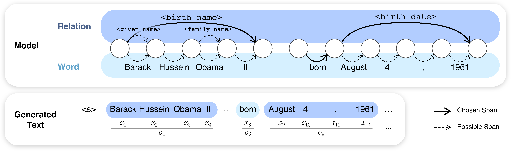

# Latent Relation Language Models

This repository contains the official PyTorch implementation of Latent Relation Language Models
([arXiv](https://arxiv.org/abs/1908.07690)):

> Hiroaki Hayashi\*, Zecong Hu\*, Chenyan Xiong, Graham Neubig<br/>
> _Latent Relation Language Models_<br/>
> The 34th AAAI Conference on Artificial Intelligence (AAAI 2020)




## Requirements

- Python 3.6+
- PyTorch 0.4+
- Other packages:
    - IPython
    - tqdm
    - tensorboardX
    - [fastText@bc12859](https://github.com/facebookresearch/fastText/tree/bc1285939f1c216bd358425c3685a049dd8f56c0)


## Usage

1. Clone this repository and install dependencies:
   ```bash
   git clone https://github.com/neulab/lrlm.git
   cd lrlm
   pip install -r requirements.txt
   ```
   To prevent incorrect or conflicting package versions, it is recommended to install dependencies in a virtual
   environment.
   
2. Download required files, including the dataset, unknown word probabilities, and (for inference only) pre-trained
   model weights:
   ```bash
   # Wikitext-S,F dataset
   wget https://github.com/neulab/lrlm/releases/download/v1.0/wikitext.tar.bz2

   # Wikifacts dataset
   wget https://github.com/neulab/lrlm/releases/download/v1.0/wikfacts.tar.bz2
   
   # Transformer-XL on WikiText-F model weights
   wget https://github.com/neulab/lrlm/releases/download/v1.0/t-xl_wt-f_model17.pt

   # Transformer-XL on WikiText-S model weights
   wget https://github.com/neulab/lrlm/releases/download/v1.0/t-xl_wt-s_model17.pt
   ```
   Note that the list of resources above are available under [releases](https://github.com/neulab/lrlm/releases).

   Please contact us for pretrained models for different configurations.

   FastText model weights can be downloaded via [google drive](https://drive.google.com/file/d/1zBBMnhYEMWXAS0QK3Wg2q_fENcKLAXTE/view?usp=sharing).
   
3. To train a new model, use one of the scripts in the `scripts/` directory, e.g.
   `scripts/train_lrlm_transformer_wikitext_short.sh`. This will create a directory for the experiment named
   `lrlm-transformer-wikitext-short` under the working directory, containing the following files:

   - `model<k>.pt`: The model checkpoint at the k-th epoch. Checkpoints are only saved when the validation results for
     that epoch improves over previous epochs.
   - `<timestamp>.txt`: The training log file.
   - `<script>.sh`: A copy of the script used to run the experiment.

   Some additional command line flags that might be useful:

   - `--exp-suffix`: Add a suffix to the name of the experiment directory.
   - `--overwrite`: Use this flag to overwrite the experiment directory. If this flag is not specified, training will
     not proceed if the experiment directory exists.
   - `--no-cuda`: The scripts enable CUDA by default. Use this flag to run on devices without GPU.
   - `--debug`: Run without saving files or writing to Tensorboard.
   - `--pdb`: Invoke the Python debugger (pdb) when an uncaught exception is encountered.
   - `--no-cache-dataset`: Do not load cached versions of the dataset. By default the processed dataset will be cached
     under the dataset path, and future runs with the same dataset configurations will be able to use the cached
     version.

4. To evaluate a trained model, use the same script for training, with the additional flags:

   - `--mode eval`: Use evaluation mode.
   - `--pretrained /path/to/experiment/dir`: Load pre-trained models from the given experiment directory. The best model
     under the directory will be loaded. You can also use a path to a specific checkpoint to load that checkpoint.

   ```bash
   ./scripts/train_lrlm_transformer_wikitext_short.sh \
       --mode eval \
       --pretrained lrlm-transformer-wikitext-short/
   ```

5. To perform inference on a trained model, use the same script for training, with the additional flags:

   - `--pretrained /path/to/experiment/dir`: Load pre-trained models from the path.
   - `--repl`: Enter interactive mode.

   This will enter an IPython interactive environment where you can play with the model. The most useful method here
   is `sample`, which will allow you to perform sampling-based decoding on the model given a topic entity from the
   dataset. The accepted arguments are:

   - `name`: The name of the topic entity, e.g. `name="Barack Obama"`.
   - `split` and `index`: The index of the topic entity, e.g. `split='test', index=1` gives the first entity from the
     test set.
   - `max_length`: Maximum number of words to generate.
   - `n_tries`: Run sampling for multiple trials, and output the generated result with the highest probability.
   - For other options, please see the method signature for `models.lrlm.LRLM.sampling_decode()`.

   For other methods that you can use, please refer to the `repl.py` file.

   Here's a demo output of running inference:
   ```
   > ./scripts/train_lrlm_wikitext_short.sh --repl --pretrained lrlm-transformer-wikitext-short/
   Random seed set to 4731
   lrlm-wikitext-short
   Loaded model weights from lrlm-wikitext-short/model31.pt
   Execute `sample(name="Barack Obama")` to generate samples for given entity.
   Execute `sample(split='test', index=1)` to generate samples for specific data entry.
   For more configurable settings, please refer to method `models.lrlm.LRLM.sampling_decode`.

   Python 3.7.3 (default, Mar 27 2019, 22:11:17)
   Type 'copyright', 'credits' or 'license' for more information
   IPython 7.6.1 -- An enhanced Interactive Python. Type '?' for help.

   In [1]: sample(name="Sonic the Hedgehog", warm_up=10)
   Sample loss: 2.624, PPL: 13.792
   Marginal sample loss: 2.615, PPL: 13.672
   Relations [Generated / Annotated]: [14 / 72]
   # of copied entities: 14
   <s> = Sonic the Hedgehog 3 = Sonic the Hedgehog is an action @-@ adventure game_
   [instance of] developed and published by Sega_[publisher] for the Sega Genesis_[
   platform] . The original instalment in the Sonic the Hedgehog_[series] series , 
   written by Takashi Iizuka_[designer] and Rafael <unk> , released on September 25
    , 2006 ( 1983 – 2000 ) before its inclusion in the Famicom in the 2009 Mario ! 
   series . Its predecessor , known as the Sonic_[series] 2052 , is released on Mar
   ch 4 , 2006 , as a video game and adds 3D . The game_[instance of] includes 2.5D
    gameplay and platforming elements , and in also the previous S&K_[followed by] 
   and a Guinness World Tour in which the game_[instance of] hosts the future , all
   owing the player to compete on the Sonic_[series] , visuals and omissions . The 
   player 's player can include gameplay " gathers , skill @-@ answer " , as oppose
   d to other scenarios , with dark levels and extreme guns . Sonic_[series] Shift 
   was first released in Japan in September 2013 for the PlayStation Vita and Mega 
   Drive_[platform] for the Ga$eCube . It was released in North America on Septembe
   r 31 , 2011 in Canada , on February 3 , 2009 , in North America on March 13 , 20
   09 , in North America on January 29 , 2011 fo$ Xbox Live Arcade . A Microsoft Wi
   ndows_[platform] version titled Sonic_[series] Quest was released in 2016 . </s>
   ```

**Note on reproducibility:** Experiments in the paper were run using PyTorch version 0.4.1 on GPUs. Using different
versions and/or devices might lead to slightly different results. 


## Understanding and Extending the Code

### Creating the Dataset

Please see [this document](docs/data.md) for a detailed description of the dataset format, and instructions for creating
the WikiText dataset from scratch. Similar process can be applied to creating your custom datasets.

### Directory Structure

```
├── README.md
├── data/                                .... Needs downloading from the link above.
│   ├── found_ids/                       .... Files containing article title to Wikidata ID mapping.
│   └── canonical_forms/                 .... Canonical forms for each entity obtained by querying to Wikipedia.
├── dataset/                             .... Dataset definitions
│   ├── aliaslm.py                       ....   Dataset for alias LM
│   ├── base.py                          ....   Base class for all datasets (include dataset for vanilla LM)
│   ├── lrlm.py                          ....   Dataset for LRLM
│   ├── nklm.py                          ....   Dataset for NKLM
│   ├── utils.py                         ....   Utilities for reading & batching
│   └── vocab.py                         ....   Utilities related to vocabulary & unk-probs
├── docs/                                .... Documentations
│   └─── data.md                          ....   Descriptions of the processed data and data generation.
├── models/                              .... Model definitions
│   ├── rnns/                            ....   Sequence model definitions
│   │   ├── base.py                      ....     Base class for all sequence models
│   │   ├── lstm.py                      ....     LSTM model
│   │   └── transformer.py               ....     TransformerXL model
│   ├── aliaslm.py                       ....   Alias LM
│   ├── base.py                          ....   Base class for all models
│   ├── lm.py                            ....   Vanilla LM
│   ├── lrlm.py                          ....   LRLM
│   ├── nklm.py                          ....   NKLM
│   ├── sample_utils.py                  ....   Utilities for sampling
│   └── utils.py                         ....   Common modules shared among models
├── nnlib/                               .... A tiny library for NNs
│   ├── arguments/                       ....   A type-annotated command line argument parser
│   └── utils/                           ....   All sorts of utility functions
├── preprocess/                          .... Scripts for preprocessing & analysis of data
├── scripts/                             .... Scripts for experiments
├── stubs/                               .... Python stub files for type annotating PyTorch
├── arguments.py                         .... Command line argument definitions
├── repl.py                              .... Utilities for REPL mode (useful for inspecting models)
├── run.py                               .... Program entry point
├── run_charlm.py                        .... Train the character-level LM for unk-probs
└── utils.py                             .... Utilities for training and checkpointing
```


## Reference

If you use this code in your research paper, please cite:
```bibtex
@inproceedings{hayashi2020latent,
  title={Latent Relation Language Models},
  author={Hayashi, Hiroaki and Hu, Zecong and Xiong, Chenyan and Neubig, Graham},
  booktitle={Proceedings of the AAAI Conference on Artificial Intelligence},
  volume={34},
  year={2020}
}
```
